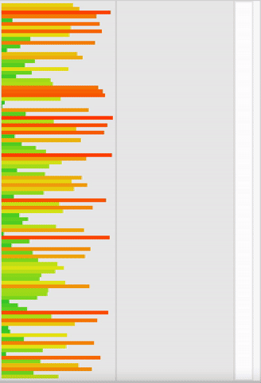
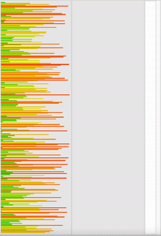

_This is a **21 School/Ecole 42** Project_

# push_swap (Sorting algorithm)

Push_swap is a program that sorts integers on a stack, with a limited set of instructions, using the lowest possible number of actions. Subject can be found [here](https://cdn.intra.42.fr/pdf/pdf/47284/en.subject.pdf).

## Project goals

* Learn about different algorithms
* Sort data using specified list of operations
* Work with stack

## To compile and run
Run the following commands in Terminal:
```shell
# to build
> make

# to run
> ./push_swap 2 1 3 6 5 8
```

The program takes as an argument the stack a formatted as a list of integers. The program prints out a list of instructions to sort the stack a.

## Available instructions:
`sa` (swap a): Swap the first 2 elements at the top of stack a. Do nothing if there is only one or no elements.

`sb` (swap b): Swap the first 2 elements at the top of stack b. Do nothing if there is only one or no elements.

`ss` : sa and sb at the same time.

`pa` (push a): Take the first element at the top of b and put it at the top of a. Do nothing if b is empty.

`pb` (push b): Take the first element at the top of a and put it at the top of b. Do nothing if a is empty.

`ra` (rotate a): Shift up all elements of stack a by 1. The first element becomes the last one.

`rb` (rotate b): Shift up all elements of stack b by 1. The first element becomes the last one.

`rr` : ra and rb at the same time.

`rra` (reverse rotate a): Shift down all elements of stack a by 1. The last element becomes the first one.

`rrb` (reverse rotate b): Shift down all elements of stack b by 1. The last element becomes the first one.

`rrr` : rra and rrb at the same time.

## Results (100 tests mean)

    4780 operations for 500 numbers
    587  operations for 100 numbers


### Sorting 100 integers



### Sorting 250 integers



## Useful links

* A good [checker](https://github.com/ksnow-be/push_swap_checker) by ksnow-be
* PushSwap GUI [checker](https://github.com/elijahkash/push_swap_gui) by elijahkash
